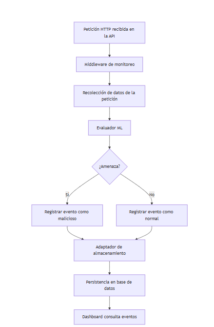
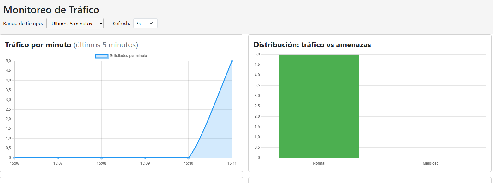

# Vigilia SDK & Nota-API

> **Vigilia SDK** es una librería para monitoreo, análisis y visualización de tráfico HTTP en APIs, con arquitectura extensible y soporte para IA. **Nota-API** es una aplicación de ejemplo que demuestra cómo integrar y utilizar Vigilia SDK en una API real.

---
## Diagrama de flujo de alto nivel (vigilia-sdk)

<p align="center">
	
</p>

## Ejemplo de dashboard

<p align="center">
	
</p>

## Resumen de los proyectos

### vigilia-sdk
- **Tipo:** Librería/SDK para Node.js
- **Funcionalidad:**
	- Monitoreo de tráfico HTTP en tiempo real
	- Dashboard web integrado (`/monitoring-dashboard`)
	- Análisis de amenazas con IA (extensible)
	- Soporte para múltiples backends de almacenamiento (MongoDB, MySQL, memoria)
- **Instalación:**
	```bash
	npm install vigilia-sdk
	```

### nota-api
- **Tipo:** API de ejemplo (Node.js + Express)
- **Funcionalidad:**
	- CRUD de notas
	- Integra y ejemplifica el uso de vigilia-sdk
	- Permite probar el monitoreo y dashboard en un entorno real

---

## Arquitectura y estructura de carpetas

### vigilia-sdk
```
vigilia-sdk/
├── adapters/      # Adaptadores de almacenamiento (mongo, mysql, memoria)
├── assets/        # Archivos estáticos (JS, CSS)
├── config/        # Configuración inicial
├── core/          # Lógica de negocio, ML, servicios
├── dashboard/     # MVC del dashboard web
├── middleware/    # Middleware de monitoreo
├── ports/         # Puertos/Interfaces (principio DIP)
├── index.js       # Punto de entrada
```


## Principios SOLID

El SDK y la app de ejemplo siguen los principios SOLID, fundamentales para el diseño de software mantenible y escalable:

- **S**ingle Responsibility (Responsabilidad Única): Cada módulo tiene una única responsabilidad clara.
- **O**pen/Closed (Abierto/Cerrado): Los módulos están abiertos a extensión pero cerrados a modificación.
- **L**iskov Substitution (Sustitución de Liskov): Las implementaciones pueden ser intercambiadas sin afectar el sistema.
- **I**nterface Segregation (Segregación de Interfaces): Interfaces pequeñas y específicas para cada necesidad.
- **D**ependency Inversion (Inversión de Dependencias): El core depende de abstracciones, no de implementaciones concretas.

---

## Patrones de arquitectura

- **Hexagonal (Ports & Adapters):**
	- El núcleo de vigilia-sdk está desacoplado de detalles externos (almacenamiento, frameworks, etc) usando puertos (interfaces) y adaptadores. Esto permite cambiar la base de datos o el motor de análisis sin modificar la lógica central.
	- Carpeta `ports/`: define interfaces.
	- Carpeta `adapters/`: implementa adaptadores concretos (Mongo, MySQL, memoria).

- **MVC (Model-View-Controller):**
	- El dashboard web sigue el patrón MVC, separando la lógica de presentación (views), la lógica de control (controllers) y los datos (models).
	- Carpeta `dashboard/`: contiene controllers, models y views del dashboard.

---


## Patrones de diseño

- **Adapter:** Permite que el core interactúe con distintos sistemas de almacenamiento mediante una interfaz común.

> [!TIP]
> [Adapter](https://refactoring.guru/es/design-patterns/adapter)

- **Factory:** Se utiliza para instanciar adaptadores de almacenamiento según la configuración elegida, desacoplando la creación de objetos concretos del resto del sistema.

> [!TIP]
> [Factory](https://refactoring.guru/es/design-patterns/factory-method)

- **Middleware:** El monitoreo de tráfico se implementa como middleware Express, interceptando todas las peticiones HTTP.


### nota-api
```
nota-api/
├── app.js           # Punto de entrada
├── db.js            # Lógica de almacenamiento en memoria
├── models/          # Modelo de Nota
├── routes/          # Rutas de la API
├── package.json     # Dependencias y scripts
```

---

## Ejemplo de uso

**Integración básica en una API Express:**
```js
const vigilia = require('vigilia-sdk');
vigilia.initMonitoringSDK({
	db: 'mongo',
	connectionString: 'mongodb://localhost:27017/monitoring',
	persistenceTime: 60
});
vigilia.serveDashboardAssets(app);
vigilia.mountDashboard(app);
app.use(vigilia.monitoringMiddleware);
```

**En nota-api:**
```js
const vigilia = require('../vigilia-sdk');
vigilia.initMonitoringSDK({ db: 'memory', connectionString: 'memory', persistenceTime: 3600 });
vigilia.serveDashboardAssets(app);
vigilia.mountDashboard(app);
app.use(vigilia.monitoringMiddleware);
```

---

## Dashboard web

Disponible en: `http://localhost:3000/monitoring-dashboard`

Widgets incluidos:
- Tráfico por minuto
- Clasificación de tráfico vs amenazas
- Top IPs maliciosas
- Tabla de eventos recientes

---

## Extensión y personalización

- Puedes crear nuevos adaptadores de almacenamiento implementando la interfaz `StoragePort`.
- El evaluador de amenazas (`core/mlEvaluator.js`) es reemplazable por modelos propios.

---

## Licencia

[](https://choosealicense.com/licenses/mit/)